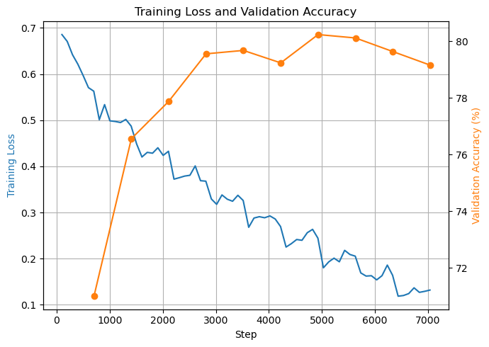
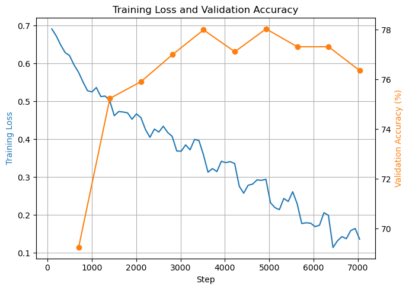
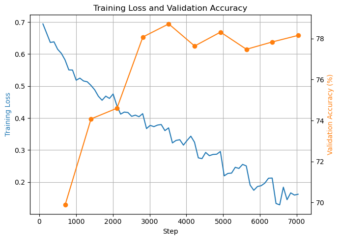

# SentimentScope: Sentiment Analysis using Transformers!

## Understanding Sentiment Analysis

Sentiment analysis is a natural language processing (NLP) technique used to determine the sentiment expressed in a piece of text. This can range from identifying the polarity (positive, negative, or neutral) of a review to analyzing emotions and opinions.

In this project, sentiment analysis is explicitly framed as a **binary classification task**, where the goal is to determine whether a given movie review is *positive* or *negative*. This task is central to many real-world applications, including customer feedback analysis, social media monitoring, and recommendation systems. By developing a transformer-based model, you will classify IMDB movie reviews as positive or negative to tackle the challenge faced by your entertainment company CineScope by enhancing its recommendation system, enabling more accurate and personalized suggestions. 

Reviews labeled as positive will be marked as 1 in the dataset, while negative reviews will be labeled as 0.

For example, consider the following movie review:

> "The movie was a rollercoaster of emotions, and I loved every moment of it!"

This review is clearly positive as it expresses enjoyment and satisfaction with the movie, hence it will be labelled as *positive* or 1 in the dataset. In contrast:

> "The plot was predictable, and the acting was subpar. A waste of time."

This review conveys a negative sentiment, criticizing both the plot and acting, hence it will be labelled as *negative* or 0 in the dataset.

While transformers are often used for generation tasks, they can also be adapted for classification tasks with some modifications to their architecture. You might already be familiar with the tweaks that we will implement in this project.

---

## Data Description

The **IMDB Large Movie Review Dataset** (Maas et al., 2011) is the standard benchmark for binary sentiment classification. Key facts:

- **Size**: 50,000 movie reviews total, pulled from IMDB.
- **Labels**: Binary — positive or negative. There's no neutral class: reviews rated ≤4/10 are labeled negative, reviews rated ≥7/10 are labeled positive. Reviews in the 5–6 range (ambiguous) were excluded entirely.
- **Balance**: Perfectly balanced — 25,000 positive, 25,000 negative overall.
- **Provided split**: It comes pre-split into **25,000 train** / **25,000 test** reviews, each half itself balanced (12,500 pos / 12,500 neg).
- **No movie overlap trick**: No more than 30 reviews come from any single movie, and the train/test sets don't share the same movies — this stops the model from just memorizing "this movie = positive" instead of learning sentiment from language.
- **Raw text quirks**: Reviews are raw scraped text, so they contain leftover HTML like `  ` line breaks, punctuation, and varying lengths (the EDA in the notebook shows this — mean review length is a couple hundred words, with a long right tail of much longer reviews).

---

## 1. Project Summary and Results

In this project, a transformer-based model (`DemoGPT`) was built from scratch and trained to classify IMDB movie reviews as positive or negative:

- The raw IMDB dataset (25,000 training reviews, 25,000 test reviews) was loaded, explored, and split into training (22,500), validation (2,500), and test (25,000) sets.
- Reviews were tokenized with the `bert-base-uncased` subword tokenizer, truncated/padded to a fixed sequence length.
- A `DemoGPT` transformer was implemented with token + positional embeddings, stacked transformer blocks (multi-head self-attention + feed-forward layer), followed by mean pooling over the sequence dimension and a linear classification head mapping to 2 output classes.
- The model was trained for 10 epochs with the AdamW optimizer and cross-entropy loss, with validation accuracy tracked after each epoch and the best-performing checkpoint saved to `models/best_model_%layers%_%embedding%.pt`.
- Final performance was evaluated on the held-out test set using `calculate_accuracy()`, with the goal of exceeding 75% accuracy.
- Three experiments were run:
  1. Baseline: 4 layers, 128 embedding dimension, 4 heads, 10 epochs
  2. Increased embedding dimension to 256 (4 layers, 8 heads, 10 epochs)
  3. Increased embedding dimension to 256 **and** number of layers to 6

---

## 2. Experimental

### 2.1 Baseline

Baseline experiment with 4 layers, 128 embedding dimension, 4 heads, 10 epochs.

#### Configuration

- Tokenizer: bert-base-uncased (subword tokenization)
- Max sequence length: 128
- Embedding dimension (d_embed): 128
- Number of transformer layers: 4
- Number of attention heads: 4
- Batch size: 32
- Optimizer: AdamW
- Learning rate = 3e-4
- Epochs trained: 10
- Train / Validation / Test split: 22,500 / 2,500 / 25,000 reviews

#### Results Summary

##### Overall Performance

| Metric | Value |
|---|---|
| Best epoch (by validation accuracy) | 7 |
| Best validation accuracy | 80.24% |
| Final test accuracy (best checkpoint) | 77.18%* |
| Total training time | 23m 56.5s |
| Testing and loading time | 1m 26s |
| Hardware used | GPU: RTX 1660 Ti, 6GB memory |

##### Per-Epoch Metrics

| Epoch | Train Loss (last logged batch) | Val Accuracy | Best So Far? | Notes |
|---|---|---|---|---|
| 1 | 0.5629 | 71.00% | Y | First checkpoint saved |
| 2 | 0.4874 | 76.56% | Y | |
| 3 | 0.4327 | 77.88% | Y | |
| 4 | 0.3679 | 79.56% | Y | |
| 5 | 0.3260 | 79.68% | Y | |
| 6 | 0.2696 | 79.24% | N | Slight dip from epoch 5 |
| 7 | 0.2444 | 80.24% | Y | **Best epoch** |
| 8 | 0.2054 | 80.12% | N | |
| 9 | 0.1638 | 79.64% | N | |
| 10 | 0.1319 | 79.16% | N | Val accuracy trending down as train loss keeps falling — sign of overfitting |

#### Training / Validation Curve

##### Qualitative Examples

Sample predictions from the `predict_sentiment()` inference examples (positive, negative, and mixed/ambiguous reviews):

- Positive example — predicted: **Positive**, confidence: 99.95%
- Negative example — predicted: **Negative**, confidence: 99.57%
- Mixed/ambiguous example — predicted: **Negative**, confidence: 98.06%

---

### 2.2 Change model capacity: increase embedding dimension from 128 to 256 and number of heads from 4 to 8

#### Configuration

- Tokenizer: bert-base-uncased (subword tokenization)
- Max sequence length: 128
- Embedding dimension (d_embed): 256
- Number of transformer layers: 4
- Number of attention heads: 8
- Batch size: 32
- Optimizer: AdamW
- Learning rate = 1e-4
- Epochs trained: 10
- Train / Validation / Test split: 22,500 / 2,500 / 25,000 reviews

#### Results Summary

##### Overall Performance

| Metric | Value |
|---|---|
| Best epoch (by validation accuracy) | 7 |
| Best validation accuracy | 78.04% |
| Final test accuracy (best checkpoint) | 76.52%* |
| Total training time | 33m 23.1s |
| Testing and loading time | 1m 32.6s |
| Hardware used | GPU: RTX 1660 Ti, 6GB memory |

##### Per-Epoch Metrics

| Epoch | Train Loss (last logged batch) | Val Accuracy | Best So Far? | Notes |
|---|---|---|---|---|
| 1 | not logged in provided output | 69.24% | Y | First checkpoint saved |
| 2 | 0.5024 | 75.24% | Y | |
| 3 | 0.4569 | 75.92% | Y | |
| 4 | 0.4075 | 77.00% | Y | |
| 5 | 0.3592 | 78.00% | Y | |
| 6 | 0.3358 | 77.12% | N | |
| 7 | 0.2942 | 78.04% | Y | **Best epoch** |
| 8 | 0.2297 | 77.32% | N | |
| 9 | 0.1991 | 77.32% | N | |
| 10 | 0.1360 | 76.36% | N | Val accuracy fell below epoch 4's level — overfitting |

#### Training / Validation Curve

##### Qualitative Examples

- Positive example — predicted: **Positive**, confidence: 90.67%
- Negative example — predicted: **Negative**, confidence: 100.00%
- Mixed/ambiguous example — predicted: **Positive**, confidence: 99.61%

---

### 2.3 Change model capacity: increase embedding dimension from 128 to 256 and number of layers from 4 to 6

> As noted in Section 1, this experiment's actual configuration (6 layers, 8 heads, 256 embedding) differs from the "256 embedding / 4 layers / 4 heads" originally planned for Experiment 3.

#### Configuration

- Tokenizer: bert-base-uncased (subword tokenization)
- Max sequence length: 128
- Embedding dimension (d_embed): 256
- Number of transformer layers: 6
- Number of attention heads: 8
- Batch size: 32
- Optimizer: AdamW
- Learning rate = 1e-4
- Epochs trained: 10
- Train / Validation / Test split: 22,500 / 2,500 / 25,000 reviews

#### Results Summary

##### Overall Performance

| Metric | Value |
|---|---|
| Best epoch (by validation accuracy) | 5 |
| Best validation accuracy | 78.72% |
| Final test accuracy (best checkpoint) | 77.60% |
| Total training time | 43m 47.2s |
| Testing and loading time | 1m 46.4s |
| Hardware used | GPU: RTX 1660 Ti, 6GB memory |

This is the only run of the three where the printed "best epoch" label (5) matches the training log's actual best epoch (5), so this result can be trusted at face value.

##### Per-Epoch Metrics

| Epoch | Train Loss (last logged batch) | Val Accuracy | Best So Far? | Notes |
|---|---|---|---|---|
| 1 | 0.5822 | 69.88% | Y | First checkpoint saved |
| 2 | 0.5025 | 74.08% | Y | |
| 3 | 0.4396 | 74.60% | Y | |
| 4 | 0.4138 | 78.08% | Y | |
| 5 | 0.3695 | 78.72% | Y | **Best epoch** |
| 6 | 0.3247 | 77.64% | N | |
| 7 | 0.2956 | 78.32% | N | Close to epoch 5 but did not beat it |
| 8 | 0.2505 | 77.48% | N | |
| 9 | 0.2125 | 77.84% | N | |
| 10 | 0.1620 | 78.16% | N | |

#### Training / Validation Curve

##### Qualitative Examples

- Positive example — predicted: **Positive**, confidence: 99.23%
- Negative example — predicted: **Negative**, confidence: 99.98%
- Mixed/ambiguous example — predicted: **Positive**, confidence: 96.84%

---

## 3. Cross-Experiment Comparison

| Experiment | d_embed | Layers | Heads | Best Val Acc | Test Acc | Training Time |
|---|---|---|---|---|---|---|
| 1. Baseline | 128 | 4 | 4 | 80.24% (epoch 7) | 77.18% | 23m 56.5s |
| 2. +Embedding, +Heads | 256 | 4 | 8 | 78.04% (epoch 7) | 76.52% | 33m 23.1s |
| 3. +Embedding, +Layers | 256 | 6 | 8 | 78.72% (epoch 5) | 77.60% | 43m 47.2s |

---

## 4. Key Takeaways

- **Bigger was not better here.** Simply increasing `d_embed` (and heads or layers) did not improve validation or test accuracy over the smaller baseline.
- **All three runs show clear overfitting after their best epoch.**
- **Training time scaled with model size but accuracy didn't follow proportionally.**